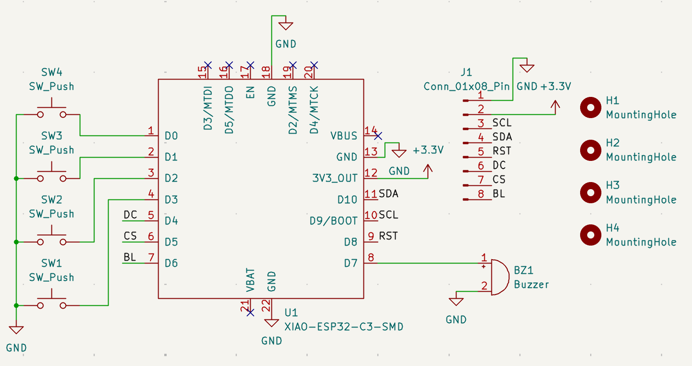
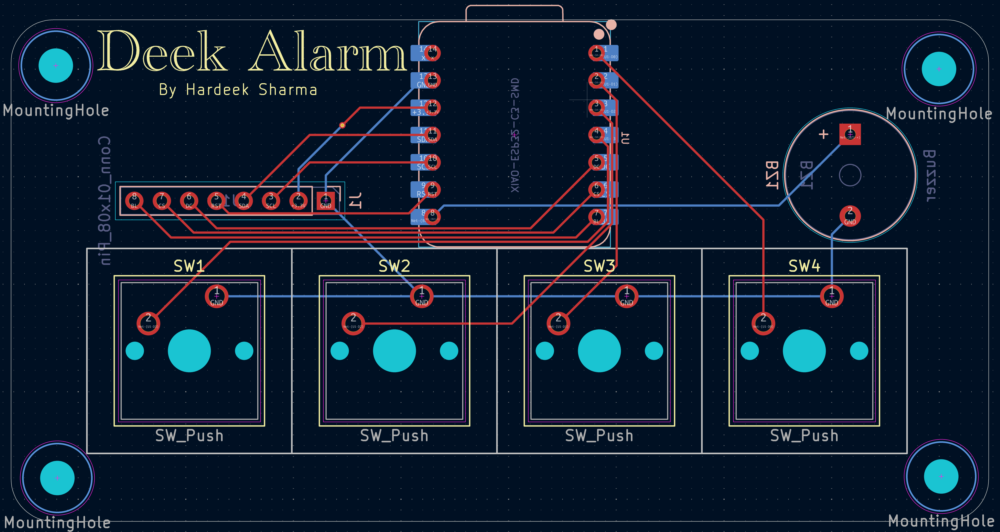

# Deek-Alarm_HackClub
An oled clock that has an alarm

## Case

## Schematic

## PCB

## Bill Of Materials

| Item | Quantity |
| --- | --- |
| Seeed XIAO ESP32C3 | 1 |
| MX-Style Keyboard Switches | 4 |
| White Blank DSA Keycaps | 4 |
| 2.25in TFT Screen | 1 |
| 3.3V Piezo Buzzer | 1 |
| 2.54mm 8 Pin Male Header (for screen) | 1 |
| 20cm Female-Female Jumper Wires (for screen) | 8 |
| M3x5x4 Heatset Inserts | 8 |
| M3x8mm Screws | 4 |
| M3x16mm Screws | 4 |

## Features

- A button to go to clock mode
- A button to go to alarm mode
- Two buttons to set clock/alarm time
- An oled screen to display time (HH:MM:SS am/pm)
- A buzzer to go off on set alarm time
